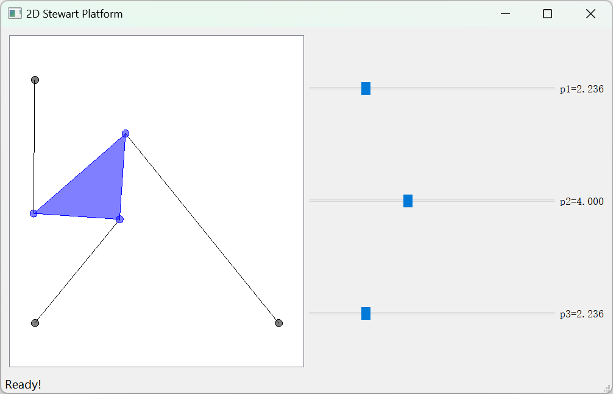

# Stewart
平面斯图尔特平台正向运动学求解及可视化。

功能：给定三个支杆的长度，找到平台的位置。
输入：三角形平台的三条边长$L_1, L_2, L_3$，边$L_2$与边$L_3$的夹角$\gamma$，三个支杆的长度$p_1, p_2, p_3$，支杆$p_2$的横坐标$x_1$，支杆$p_3$的坐标$(x_2, y_2)$。
输出：三角形平台的坐标$(x, y)$和边$L_3$与水平方向的夹角$\theta$。

